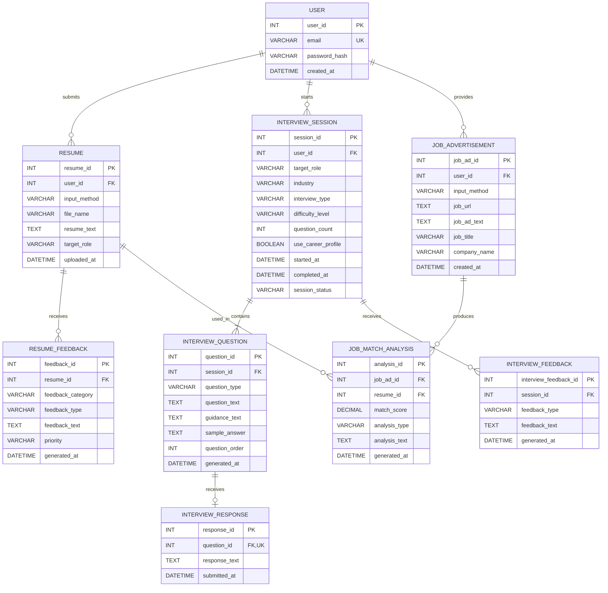

# Entity Relationship Diagram

This ERD represents the current database implementation of the AI Career Readiness Assistant. It contains nine entities and reflects the implemented MariaDB schema following the documented scope evolution and prototype refinement.

## Current ERD

## Relationship Summary

- One user can submit many resumes.
- One resume can receive many resume feedback records.
- One user can start many interview sessions.
- Each interview session contains one or more interview questions.
- Each interview question can have zero or one interview response.
- One interview session can receive many interview feedback records.
- One user can provide many job advertisements.
- One job advertisement can produce many job match analysis records.
- One resume can be used in many job match analyses.

The `INTERVIEW_RESPONSE.question_id` field is constrained as unique in the database, enforcing the zero-or-one response per interview question relationship.

The Job Advertisement and Job Match Analysis entities represent the lecturer-requested scope evolution reflected in the current prototype. The platform does not automatically retrieve SEEK content; job advertisement information is user supplied.