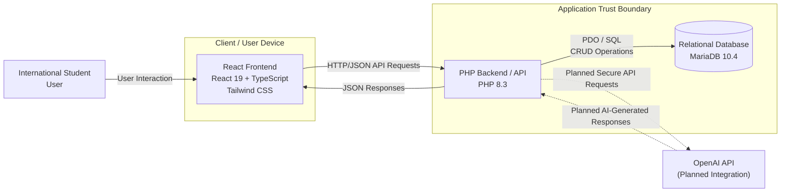

# System Architecture

## Architecture Notes

The React frontend provides the user interface for account access, resume feedback, interview preparation and job advertisement comparison. The frontend communicates with PHP API endpoints using JSON requests.

The PHP backend is responsible for server-side validation, database access and application logic. The current implementation includes a database health check, user registration and login credential verification.

MariaDB provides persistent relational storage based on the project's revised ERD. The database contains nine entities covering users, resumes, resume feedback, interview sessions, interview questions, interview responses, interview feedback, job advertisements and job match analyses.

The OpenAI API is shown as a planned external service because live generative AI integration has not yet been implemented. It will support AI-assisted resume feedback and interview preparation in later development.

Job advertisement information is supplied by the user. The current architecture does not retrieve job advertisements automatically from SEEK and therefore does not represent SEEK as an integrated external API.

The application boundary separates the project's backend and database from the user-facing client and external AI service. Sensitive configuration values, including database credentials and future API keys, are stored in local environment configuration and excluded from version control.
